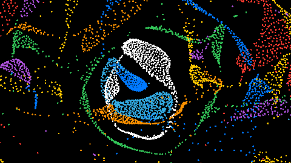

# ParticleLife

<p align=center>  
    
</p>  

> [!NOTE]  
> This project is a work in progress and is not in its final state!  

A ParticleLife Simulation written in C, using OpenGL and SDL3.
Particle Life is a particle simulation that produces emergent, lifelike behavior from a simple set of pairwise attraction rules.  

The interesting part is emergent complexity: the rules are entirely local and pairwise, but the global behavior — clusters forming, structures orbiting each other, species-like groupings — arises spontaneously from the random attraction matrix. Every run produces a different "ecosystem."  

## Dependencies

This software was developed in the Linux environment - specifically Ubuntu. The dependencies to run this software are as follows  

* gcc  
* make  
* SDL3 - windowing, context creation, and event handling. Vendored locally under `vendor/SDL3/`  
* GLAD - Loads OpenGL function pointers at runtime so the code can call OpenGL functions. Vendored locally under `vendor/GLAD/`  
* Nuklear - Single-header immediate-mode GUI used for user interaction. Vendored locally under `vendor/Nuklear/`  
* cglm - C Math library used for the orthographic projection matrix. Linked as a system library `-lcglm`  
* OpenGL 4.3 - Required for the compute shaders (`#version 430 core`) that run the particle physics  

The vendored libraries (SDL3, GLAD, Nuklear) require no installation. The only dependency you need to install yourself is cglm:  

```bash
sudo apt install libcglm-dev
```

## Usage

### Build

To build ParticleLife run:

```bash
make all
```

This command will assemble and link all the source files and dependencies - creating the ParticleLife executable under the `build` directory.

### Run

Once built, launch the simulation from the project root:

```bash
./build/ParticleLife
```

### Documentation

The source is annotated with Doxygen comments. To generate browsable HTML documentation (requires `doxygen` installed via `sudo apt install doxygen`):

```bash
make docs
```

The generated docs are written to `docs/html/index.html`.

## ToDo

* Expose simulation parameters (attraction matrix, particle count, friction) through the GUI.  

## Contributions

**This project is not accepting contributions.**  
This is a personal project that I am maintaining on my own. Pull requests, merge requests, and issues will not be reviewed or addressed. Thank you for your interest.  
